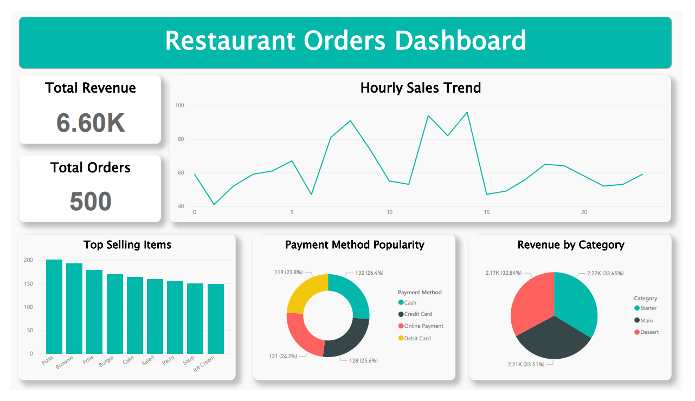

# Restaurant Orders Analysis

## Overview
This project analyzes 500 restaurant orders to explore sales patterns, 
popular menu items, and customer behavior using SQL, Excel, and Power BI.

## Tools Used
- Excel — data cleaning & date formatting
- SQL / DB Browser — data exploration
- Power BI — interactive dashboard

## Data Cleaning
- Fixed date/time formatting in Excel
- Verified no duplicates or missing values across 500 rows

## Questions Explored
1. Which menu item sells the most?
2. Which category generates the highest revenue?
3. What is the most preferred payment method?
4. What time of day do customers order the most?
5. How much revenue does each category generate?

## Key Findings
- 🍕 Pizza is the best-selling menu item
- 🕑 Peak ordering hour is 14:00
- 💵 Cash is the most preferred payment method
- 📊 Revenue by category: Starter (2,220.69) > Main (2,211.06) > Dessert (2,166.84)

## Dashboard

## Data Source
https://www.kaggle.com/datasets/haseebindata/restaurant-orders 

## Notes
Built with assistance from Claude (AI) for syntax guidance and layout suggestions.
